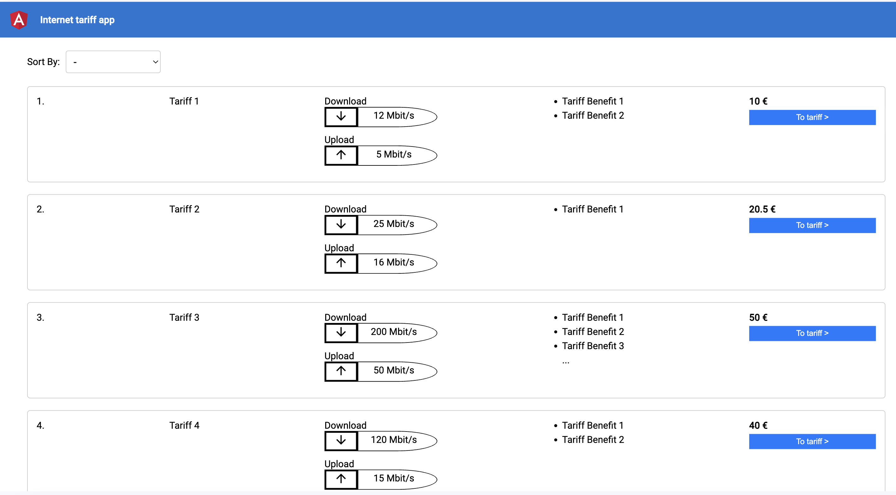

# InternetTariffApp

This project was generated with [Angular CLI](https://github.com/angular/angular-cli) version 16.2.5.
This is a simple web application built with Angular for viewing and sorting internet tariffs.

## Features

- Get tariff data from fake api server.
- List tariff data.
- Able to sort with specific filename.
- Able to clear sorting.
- Different views for different screen sizes.

## Screenshoot

## Development

Run `npm install` to create the node_modules foder, then run `npm start`  for a dev server. Navigate to `http://localhost:4200/`. The app will automatically reload if you change any of the source files.

## Fake API

The tariff data is generated via my json server: https://my-json-server.typicode.com/Halemo91/internet-tariff-app/tariffs
The db.json file contains the tariff object, which my json server reads.

## Code scaffolding

Run `ng generate component component-name` to generate a new component. You can also use `ng generate directive|pipe|service|class|guard|interface|enum|module`.

## Build

Run `ng build` to build the project. The build artifacts will be stored in the `dist/` directory.

## Running unit tests

Run `ng test` to execute the unit tests via [Karma](https://karma-runner.github.io).

## Running end-to-end tests

Run `ng e2e` to execute the end-to-end tests via a platform of your choice. To use this command, you need to first add a package that implements end-to-end testing capabilities.

## Further help

To get more help on the Angular CLI use `ng help` or go check out the [Angular CLI Overview and Command Reference](https://angular.io/cli) page.
